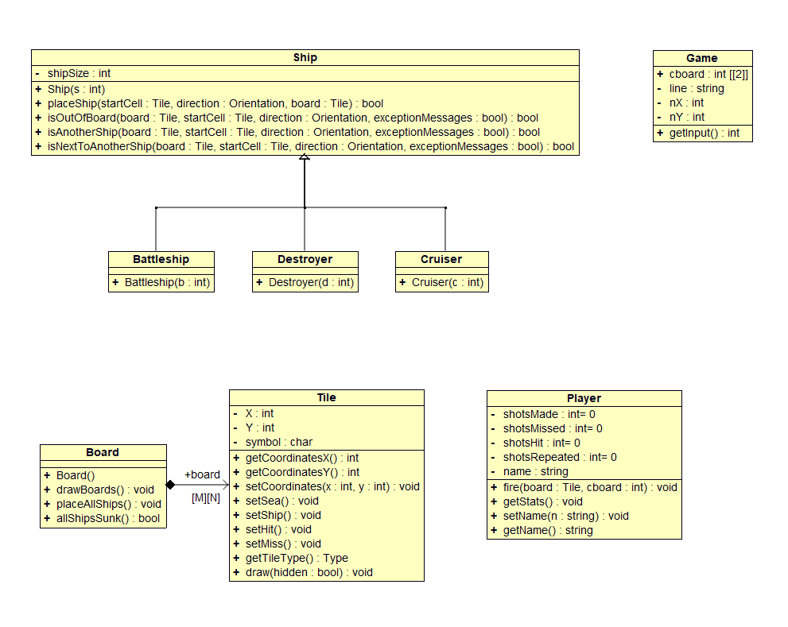

# Battleship Game

## About The Project

This project was part of the Computer Engineering and Informatics Department (CEID) of University of Patras curriculum.

This is a terminal version of the game Battleship written in C++.

## UML Diagram

## Tools

- Code::Blocks IDE
